# nanoGPT 初学者学习笔记

这份文档是给初学者看的，不追求一开始讲完所有细节，而是先建立整体感觉，再逐步把项目代码和核心概念对应起来。

## 1. 这个项目大概在做什么

nanoGPT 是一个用来训练小型 GPT 文本生成模型的项目。

它的核心任务只有一句话：

```text
根据前面的文字，预测下一个 token。
```

比如给模型：

```text
To be or not to
```

模型要猜下一个可能是：

```text
be
```

训练很多次之后，模型就能根据一个开头继续生成文本。

## 2. 整体流程

整个项目可以先理解成 4 步：

```text
1. 准备数据
2. 定义模型
3. 训练模型
4. 使用模型生成文本
```

对应到项目文件：

```text
data/*/prepare.py  -> 把文字变成数字 token
model.py           -> 定义 GPT 模型
train.py           -> 训练模型
sample.py          -> 加载模型并生成文本
config/*.py        -> 不同训练任务的配置
```

更完整的流水线是：

```text
原始文本
  -> prepare.py 转成 train.bin / val.bin
  -> train.py 读取数据
  -> model.py 里的 GPT 做预测
  -> loss 衡量预测错多少
  -> 反向传播和 optimizer 修改参数
  -> 保存 ckpt.pt
  -> sample.py 加载 ckpt.pt 生成文本
```

### 2.1 项目总流程图

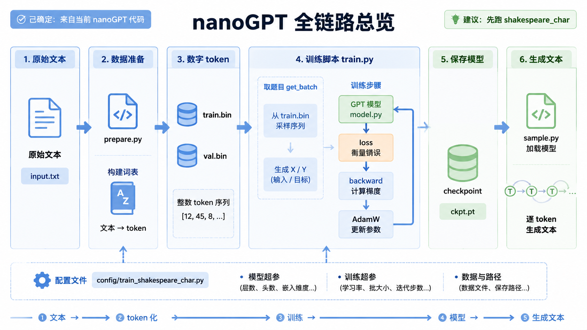

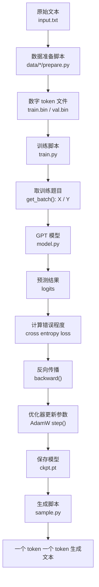

### 2.2 训练主循环时序图

这张图看的是 `train.py` 训练时一次迭代里各个部分的调用顺序。

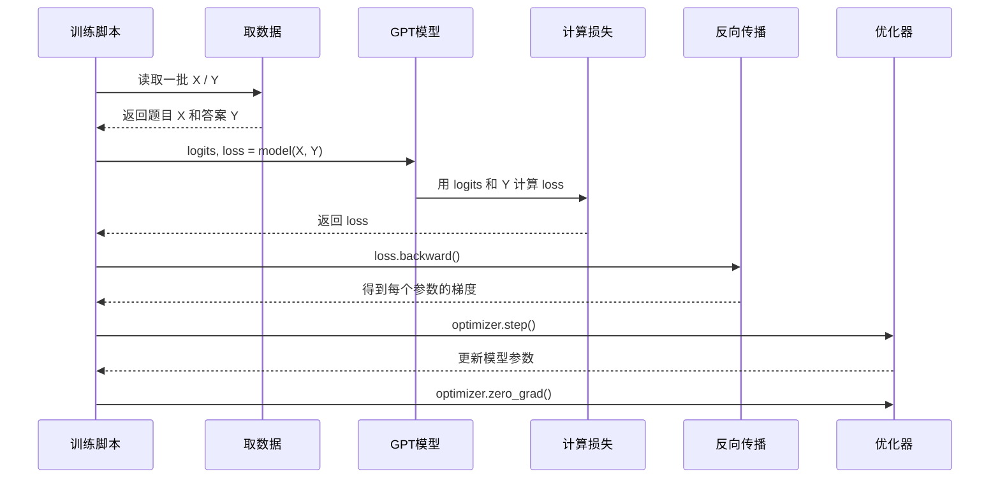

## 3. 为什么文字要变成数字

神经网络本质上只会做数学计算，比如加法、乘法、矩阵运算。

它不能直接理解：

```text
hello
```

所以要先把文字变成数字。

比如我们规定：

```text
h -> 1
e -> 2
l -> 3
o -> 4
```

那么：

```text
hello
```

就会变成：

```text
[1, 2, 3, 3, 4]
```

这些数字一开始只是编号，不代表真正含义。真正进入模型后，它们还会被转换成向量，这一步叫 embedding。

项目中对应的数据准备脚本：

```text
data/shakespeare_char/prepare.py
```

这个脚本会把莎士比亚文本里的每个字符映射成一个整数。

### 3.1 文字变数字流程图

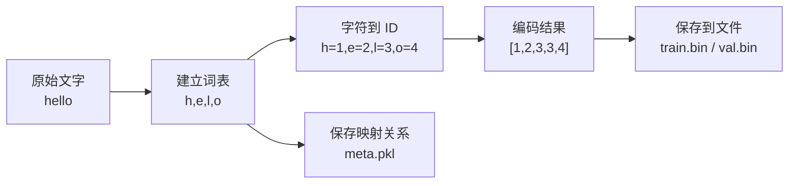

## 4. x 和 y 是什么

GPT 训练时做的是：

```text
根据前文，预测下一个 token。
```

假设原始文本是：

```text
hello
```

编码后是：

```text
[1, 2, 3, 3, 4]
```

训练时会拆成：

```text
x = [1, 2, 3, 3]
y = [2, 3, 3, 4]
```

也就是：

```text
x: h e l l
y: e l l o
```

模型要学会：

```text
看到 h        -> 预测 e
看到 h e      -> 预测 l
看到 h e l    -> 预测 l
看到 h e l l  -> 预测 o
```

所以可以先记住：

```text
x 是题目
y 是答案
```

项目中对应代码：

```text
train.py 里的 get_batch(split)
```

它会从一大串 token 里随机截一段作为 x，再把这段整体右移一位作为 y。

### 4.1 x / y 切片图

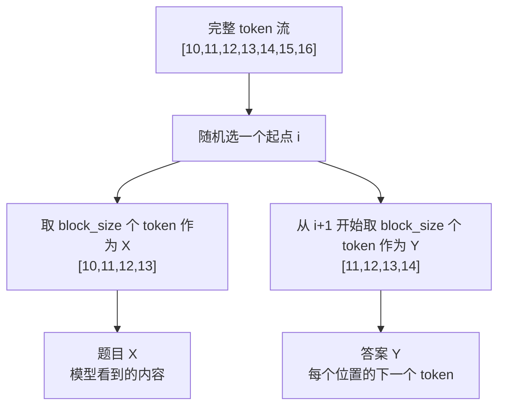

### 4.2 预测位置对应关系

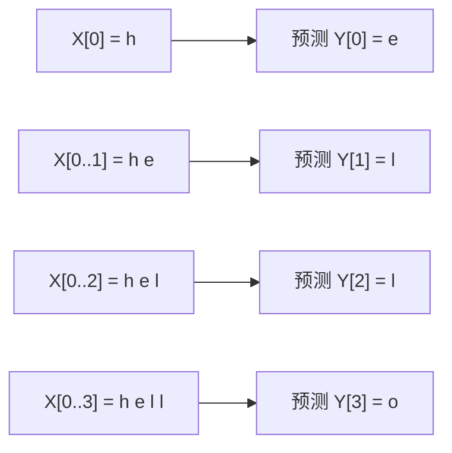

## 5. embedding 是什么

前面说过，token 会先变成整数 ID。

比如：

```text
h -> 1
e -> 2
l -> 3
```

但是这些 ID 只是编号，模型不能直接从编号里理解语言。

所以模型会把每个 ID 转成一组可以学习的数字：

```text
1 -> [0.12, -0.30, 0.44, 0.91]
2 -> [-0.51, 0.22, 0.18, -0.07]
3 -> [0.33, 0.80, -0.12, 0.45]
```

这个过程叫 embedding。

可以把 embedding 理解成：

```text
给每个 token 发一张可学习的特征卡。
```

在 nanoGPT 里主要有两种 embedding：

```text
token embedding     -> 表示这个 token 是什么
position embedding  -> 表示这个 token 在第几个位置
```

为什么需要位置？

因为：

```text
我喜欢你
你喜欢我
```

这两句话用到的字很像，但顺序不同，意思也不同。

所以模型真正拿到的是：

```text
token embedding + position embedding
```

对应代码在：

```text
model.py 里的 GPT.forward()
```

### 5.1 embedding 流程图

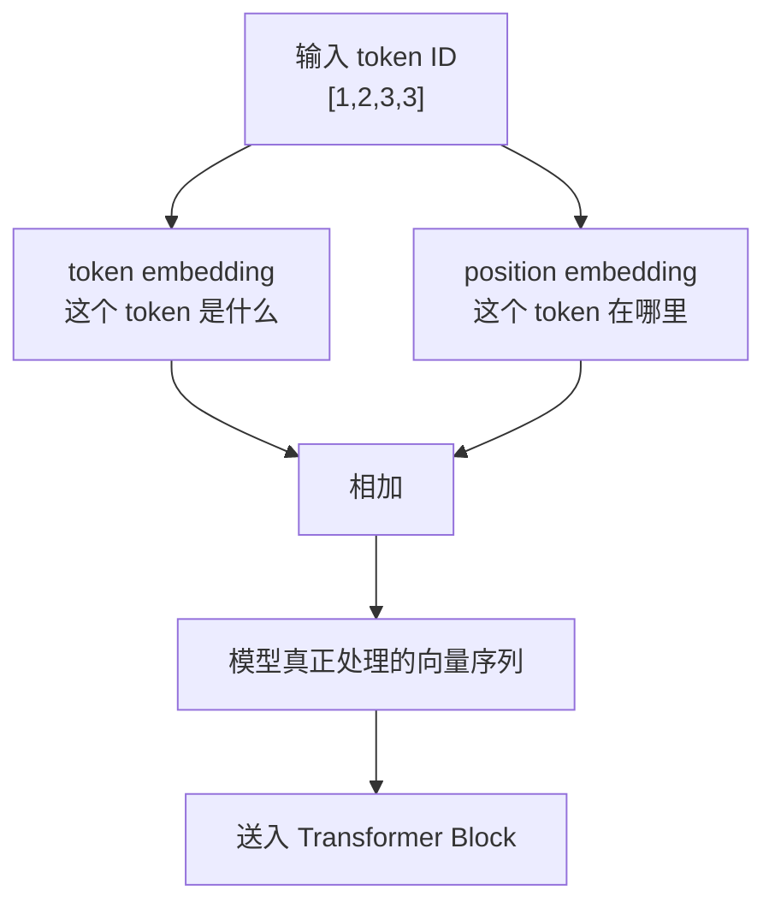

## 6. attention 是什么

attention 可以先理解成：

```text
当前 token 回头看前面的 token，并判断哪些更重要。
```

比如：

```text
我 喜欢 苹果，因为 它 很 甜
```

当模型看到“它”的时候，它需要知道“它”大概率指的是“苹果”。

attention 做的事情就是让“它”回头看前文，并给不同位置分配不同重要性：

```text
我       重要性低
喜欢     重要性低
苹果     重要性高
因为     重要性中
```

GPT 使用的是 causal attention，也就是因果注意力。

它有一个重要限制：

```text
当前位置只能看自己和前面的内容，不能偷看后面的答案。
```

例如：

```text
第 1 个 token：只能看第 1 个
第 2 个 token：可以看第 1、2 个
第 3 个 token：可以看第 1、2、3 个
第 4 个 token：可以看第 1、2、3、4 个
```

这能保证训练时模型没有作弊。

对应代码在：

```text
model.py 里的 CausalSelfAttention
```

### 6.1 causal attention 可见范围图

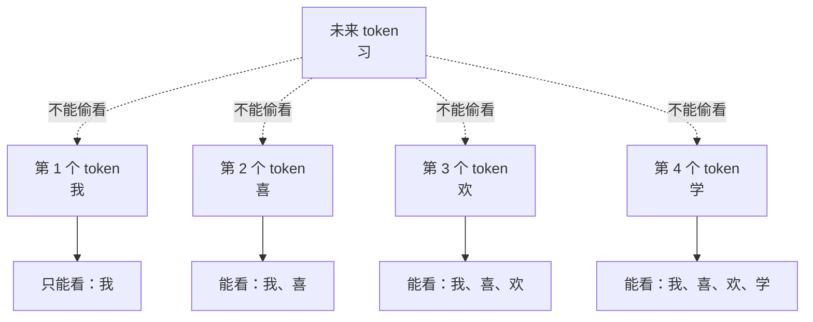

## 7. Q、K、V 是什么

attention 里面经常看到三个词：

```text
Q = Query
K = Key
V = Value
```

可以用图书馆找书来理解：

```text
Q：我想找什么？
K：这本书的标签是什么？
V：这本书真正的内容是什么？
```

放到模型里：

```text
Q 负责提问
K 负责匹配
V 负责提供信息
```

当前 token 会用自己的 Q 去匹配前面 token 的 K，匹配分数越高，就越关注那个 token，然后读取它的 V。

一句话记住：

```text
Q 和 K 决定看谁，V 决定拿到什么信息。
```

对应代码在：

```text
model.py 里的 CausalSelfAttention.forward()
```

### 7.1 Q/K/V 匹配图

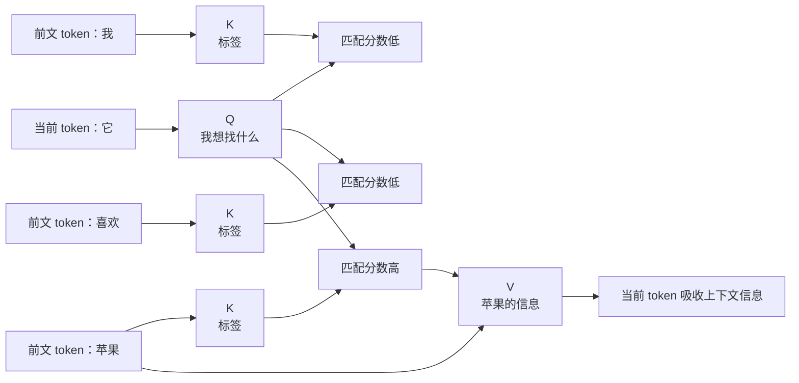

## 8. multi-head attention 是什么

multi-head attention 叫多头注意力。

它的直觉是：

```text
让多个小助手从不同角度看同一句话。
```

一个 head 可能关注“代词指代”，另一个 head 可能关注“主语和动作”，还有一个 head 可能关注“标点和换行”。

所以：

```text
single-head attention = 一个视角看上下文
multi-head attention  = 多个视角同时看上下文
```

在配置文件里可以看到：

```python
n_head = 6
```

这表示模型有 6 个 attention head。

对应配置：

```text
config/train_shakespeare_char.py
```

### 8.1 多头注意力图

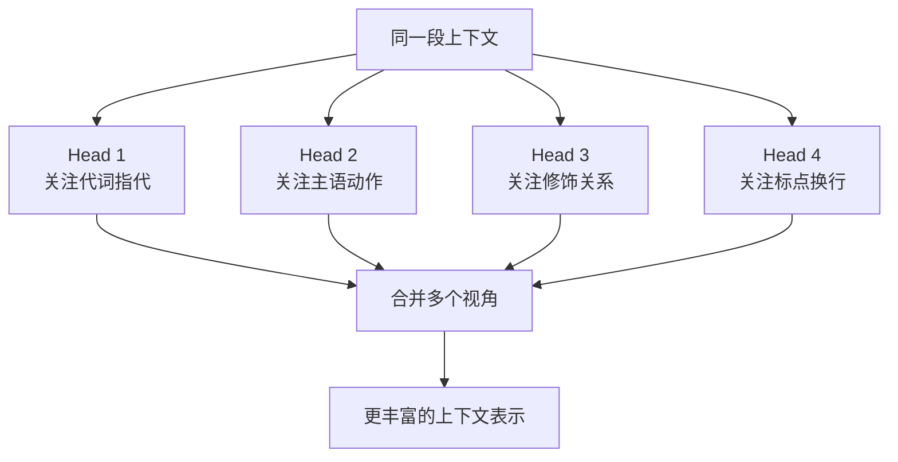

## 9. Transformer Block 是什么

GPT 不是只有一层 attention，而是很多个 Transformer Block 堆起来。

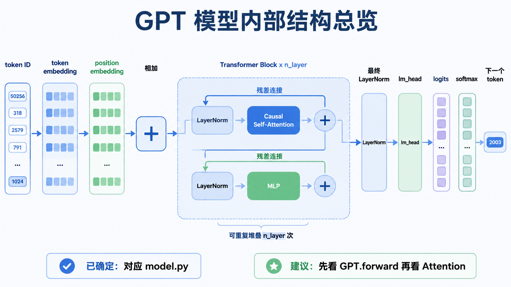

一个 block 大概是：

```text
输入
  -> LayerNorm
  -> Attention
  -> 残差连接
  -> LayerNorm
  -> MLP
  -> 残差连接
  -> 输出
```

可以先这样理解：

```text
Attention 负责和上下文交流
MLP 负责对当前信息再加工
残差连接负责保留原始信息，同时叠加新理解
```

在配置里：

```python
n_layer = 6
```

表示有 6 个 Transformer Block。

对应代码：

```text
model.py 里的 Block
model.py 里的 GPT
```

### 9.1 Transformer Block 结构图

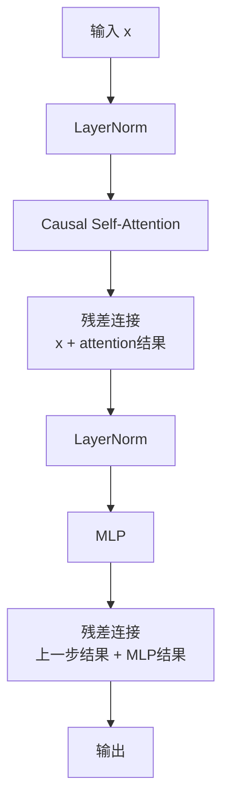

### 9.2 GPT 模型堆叠图

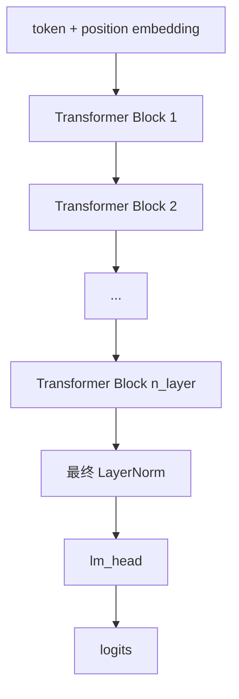

## 10. logits 和 softmax 是什么

模型经过多层 Transformer Block 之后，每个位置都会得到一个向量。

比如输入：

```text
我 喜 欢 学
```

最后一个位置“学”会得到一个向量。

接下来模型要把这个向量变成：

```text
下一个 token 是谁？
```

模型会给词表里的每个 token 打一个原始分数，这些分数叫 logits。

例如：

```text
我：-1.2
喜： 0.3
欢： 0.8
学：-0.5
习： 3.1
```

这些分数还不是概率，因为它们可以是负数，也不会加起来等于 1。

softmax 的作用是：

```text
把 logits 转成概率。
```

例如：

```text
我：2%
喜：5%
欢：9%
学：3%
习：81%
```

所以：

```text
logits -> softmax -> 每个 token 的概率
```

对应代码：

```text
model.py 里的 lm_head
model.py 里的 generate()
```

### 10.1 logits 到概率图

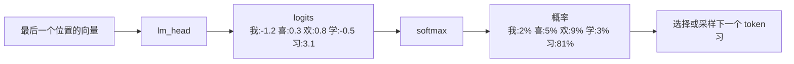

## 11. loss 是什么

loss 用来衡量模型预测错得有多严重。

如果正确答案是：

```text
习
```

模型预测：

```text
习：80%
```

那 loss 会比较低。

如果模型预测：

```text
习：10%
```

那 loss 会比较高。

nanoGPT 使用的是 cross entropy loss，也就是交叉熵损失。

可以先理解为：

```text
惩罚模型没有把正确答案放到高概率位置。
```

对应代码：

```text
model.py 里的 F.cross_entropy(...)
```

训练的目标就是：

```text
让 loss 越来越小。
```

### 11.1 loss 计算位置图

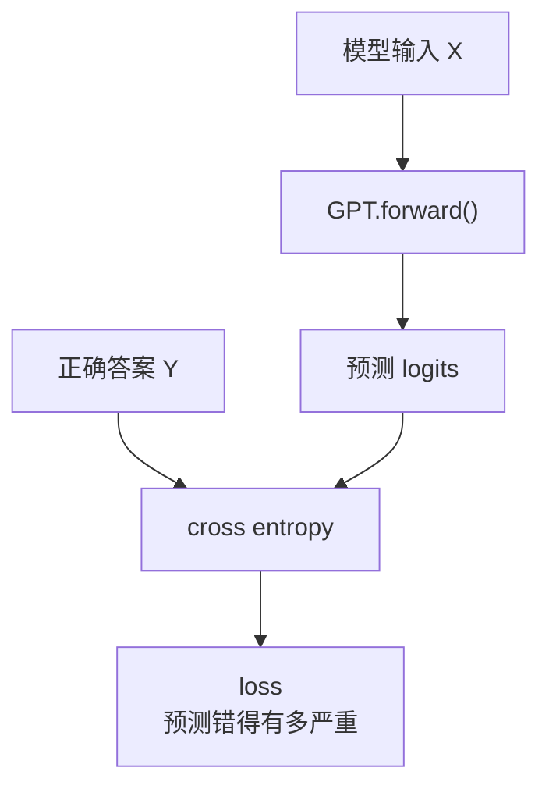

## 12. 反向传播和 optimizer 是什么

模型里面有很多参数，可以先理解成很多“旋钮”。

一开始这些参数大多是随机的，所以模型乱猜，loss 很高。

训练就是不断调整这些参数，让 loss 变小。

完整过程是：

```text
1. 模型拿到 x
2. 向前计算，得到预测 logits
3. 和 y 比较，得到 loss
4. 反向传播，计算每个参数的梯度
5. optimizer 根据梯度更新参数
6. 清空旧梯度，准备下一轮
```

可以记成：

```text
预测 -> 算错多少 -> 找责任 -> 改参数 -> 再来一次
```

专业词是：

```text
forward -> loss -> backward -> optimizer step -> zero grad
```

在 nanoGPT 里对应：

```python
logits, loss = model(X, Y)
scaler.scale(loss).backward()
scaler.step(optimizer)
optimizer.zero_grad(set_to_none=True)
```

其中：

```text
backward     -> 根据 loss 计算梯度
optimizer    -> 根据梯度更新模型参数
zero_grad    -> 清空旧梯度
```

nanoGPT 用的是 AdamW optimizer。

对应代码：

```text
train.py 的训练循环
model.py 里的 configure_optimizers()
```

### 12.1 参数更新闭环图

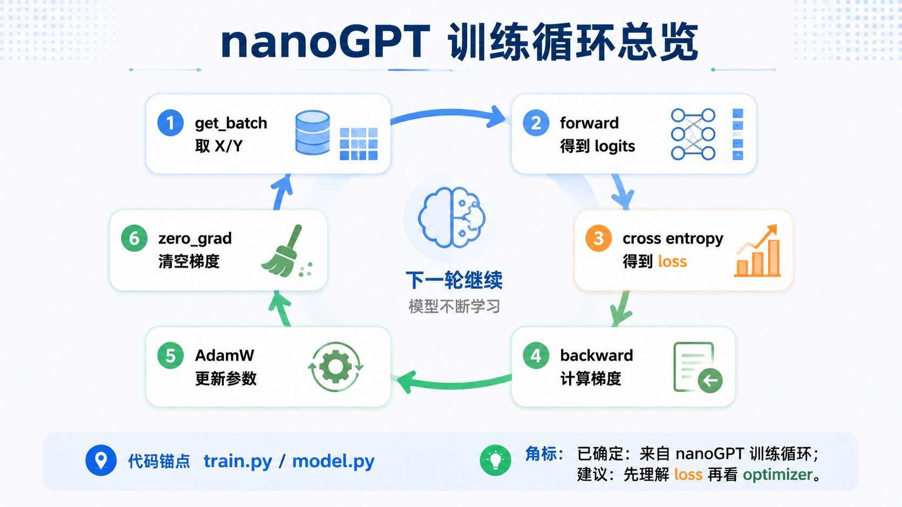

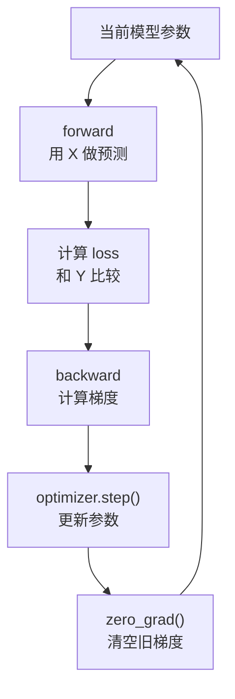

### 12.2 训练过程中的关键代码时序

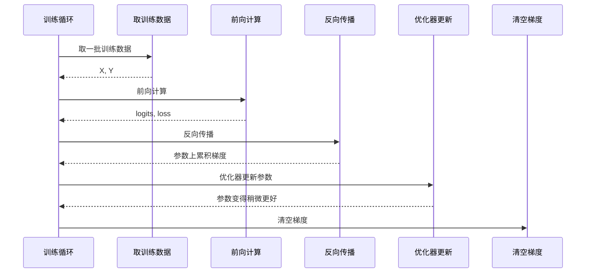

## 13. 生成文本时发生了什么

训练完成后，会得到一个 checkpoint：

```text
ckpt.pt
```

生成文本时，流程是：

```text
1. 加载训练好的模型
2. 输入一个开头 prompt
3. 模型预测下一个 token
4. 把预测出来的 token 接到原文后面
5. 再预测下一个 token
6. 重复很多次
```

也就是说，GPT 不是一次生成整篇文章，而是：

```text
一个 token 一个 token 地往后接。
```

对应代码：

```text
sample.py
model.py 里的 generate()
```

### 13.1 生成文本时序图

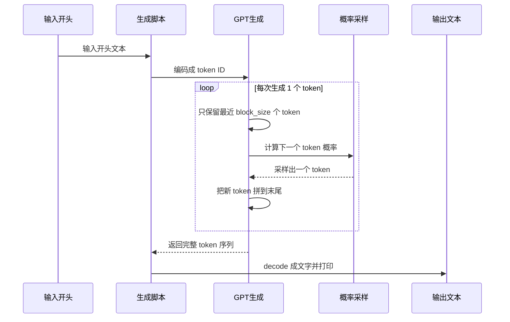

### 13.2 生成闭环图

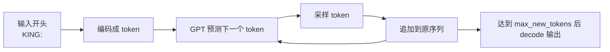

## 14. 推荐学习顺序

建议不要一开始就啃完整代码，可以按这个顺序来：

```text
1. 先理解这个文档里的整体流程
2. 看 data/shakespeare_char/prepare.py
3. 看 train.py 里的 get_batch()
4. 看 model.py 里的 GPT.forward()
5. 看 model.py 里的 CausalSelfAttention
6. 看 train.py 的训练循环
7. 看 sample.py 和 generate()
```

最推荐先跑字符级 Shakespeare 示例，因为它最小、最直观。

准备数据：

```powershell
python data/shakespeare_char/prepare.py
```

CPU 上先跑一个小训练：

```powershell
python train.py config/train_shakespeare_char.py --device=cpu --compile=False --max_iters=200
```

生成文本：

```powershell
python sample.py --out_dir=out-shakespeare-char --device=cpu
```

### 14.1 代码阅读路线图

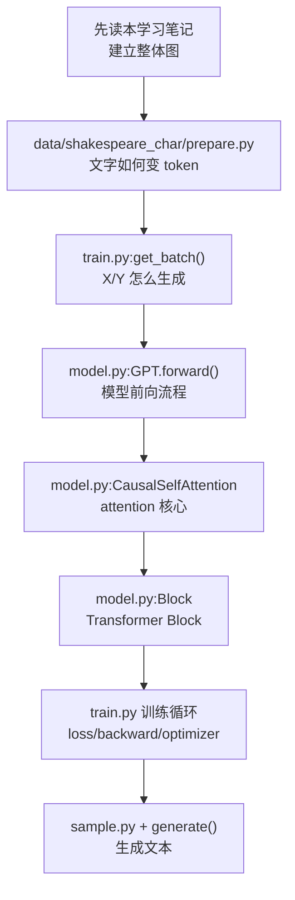

## 15. 先记住这张总图

```text
文字
  -> token 数字
  -> x / y 训练题目
  -> token embedding + position embedding
  -> 多层 Transformer Block
  -> logits
  -> softmax 概率
  -> loss
  -> backward 计算梯度
  -> optimizer 更新参数
  -> 训练完成
  -> generate 一个 token 一个 token 生成文本
```

如果只能记住一句话：

```text
nanoGPT 训练的核心，就是让模型不断练习“根据前文预测下一个 token”，并通过 loss、反向传播和 optimizer 一点点改进自己。
```
